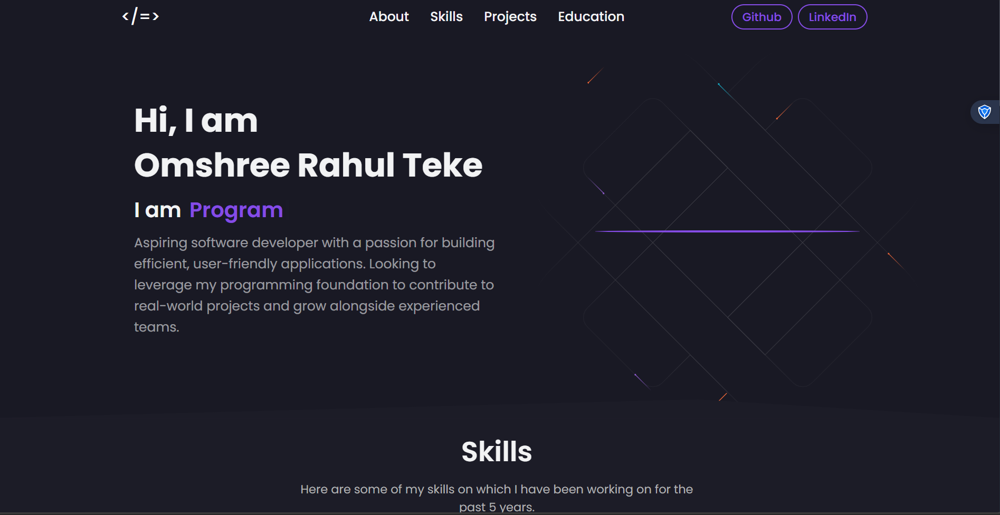

# 🚀 Omshree Teke - Portfolio

A personal portfolio website built with React.js to showcase my skills, projects, and education.

## 🌐 Live Demo


## 📸 Preview


## 🛠️ Tech Stack
- **React.js** - Frontend framework
- **Styled Components** - CSS in JS styling
- **Material UI** - UI components and icons
- **Typewriter Effect** - Animated text

## 📌 Features
- Responsive design for all devices
- Animated hero section with typewriter effect
- Skills section with tech stack
- Projects showcase
- Education timeline
- Contact form
- Downloadable resume

## 🚀 Getting Started

### Installation
```bash
git clone https://github.com/omshree-teke/portfolio.git
cd portfolio
npm install
npm start
```

